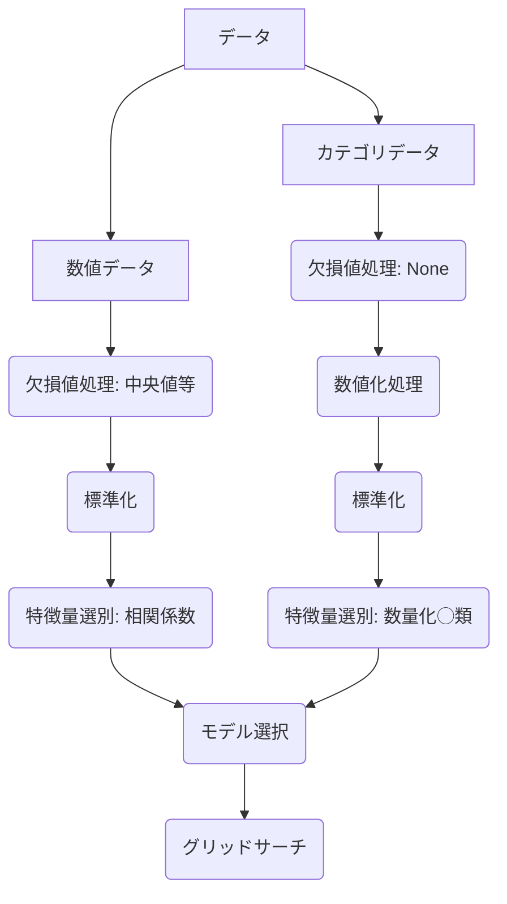

# Kaggleの基本的なアプローチ
データが与えられたときには以下のように進めると良い。

- 欠損値処理
    - 数値データ: 平均値, 中央値, 最頻値で埋める
    - カテゴリデータ: None, 最頻値で埋める
---
- 標準化、正規化
    - 標準化: 平均0, 分散1にする
    - 正規化: 0~1の範囲にする
---
- 数値化処理: Label Encoding, One-Hot Encoding
    - Label Encoding: カテゴリデータを数値データに変換
    - One-Hot Encoding: カテゴリデータをバイナリデータに変換
---
- モデル選択
    - 回帰: 線形回帰, ラッソ回帰, リッジ回帰, ランダムフォレスト回帰, XGBoost回帰
    - 分類: ロジスティック回帰, SVM, 決定木, ランダムフォレスト, XGBoost, LightGBM
    - 時系列: ARIMA, LSTM, GRU
    - クラスタリング: K-means, DBSCAN, 階層的クラスタリング, GMM
---

# 工夫の余地
- 特徴量エンジニアリング
    - 特徴量の追加: 交互作用特徴量, 多項式特徴量
    - 特徴量の削除: 相関係数が高い特徴量
    - 特徴量の変換: 対数変換, 逆数変換
---
- モデルのチューニング
    - ハイパーパラメータのチューニング: グリッドサーチ, ランダムサーチ
    - アンサンブル学習: バギング, ブースティング, スタッキング
---
- データの拡張
    - オーバーサンプリング: SMOTE
    - アンダーサンプリング: NearMiss
---
- モデルの選択
    - ディープラーニング: CNN, RNN, Transformer
    - ベイズ最適化: Optuna
    - 自動機械学習: AutoML
---

